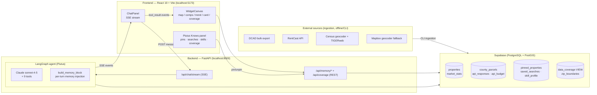

# Architecture — DFW Realtor Agent Platform

> Companion docs: [SYSTEM-FLOWS.md](./SYSTEM-FLOWS.md) (end-to-end sequence flows) ·
> [DEMO-GUIDE.md](./DEMO-GUIDE.md) (demo script & talk track)

## What this is

An AI-powered market-research **control center** for novice real-estate license
holders in the Dallas–Fort Worth metroplex. The user talks to **Plutus** — a
LangGraph agent backed by Claude — and Plutus composes the workspace for them:
maps, comps tables, trend charts, and property cards appear on a widget canvas
as side effects of the conversation. Plutus has **persistent memory** (pinned
properties, saved searches, a per-concept skill profile) and **truthful
data-coverage awareness** — it knows exactly which ZIPs and counties it has
data for and refuses to bluff beyond them.

The platform runs on real data: 41k+ Dallas County appraisal parcels (DCAD bulk
export), RentCast market statistics and sold listings, Census-geocoded
coordinates, and Census ZCTA boundary polygons.

## High-level diagram



## Tech stack

| Layer | Technology |
|---|---|
| Frontend | React 19, TypeScript, Vite, Tailwind CSS (shadcn design tokens), react-map-gl 8 / mapbox-gl 3, ECharts 6, react-markdown, react-resizable-panels, lucide-react |
| Backend | Python 3.11+, FastAPI, LangGraph + langchain-anthropic (`claude-sonnet-4-5`), supabase-py, asyncpg (bulk ingestion), httpx |
| Database | Supabase — PostgreSQL with PostGIS (`GEOGRAPHY(POINT)` columns, GIST indexes) |
| Testing | pytest + respx (76 backend tests), vitest (12 frontend tests) |
| Tooling | uv-managed venv (`backend/.venv`), npm workspaces (root lockfile), ESLint, tsc |

## Repository layout

```
RealtorAgentPlatform/
├── backend/
│   ├── main.py                 # FastAPI app: CORS, router mounting, /health
│   ├── api/
│   │   ├── chat.py             # POST /api/chat/stream (SSE) + /message
│   │   └── memory.py           # REST CRUD for pins/searches/skills + /api/coverage
│   ├── agent/
│   │   ├── graph.py            # LangGraph StateGraph: agent ⇄ tools loop, SSE streaming
│   │   ├── tools.py            # Data tools: fetch_market_data, get_comparable_sales
│   │   ├── memory_tools.py     # 7 memory/control tools (never raise)
│   │   ├── prompts.py          # Plutus system prompt (memory/teaching/coverage rules)
│   │   └── state.py            # AgentState TypedDict
│   ├── plutus/
│   │   ├── __init__.py         # PLUTUS_USER_ID (single-user POC constant)
│   │   └── memory.py           # build_memory_block() — per-turn memory injection
│   ├── db/client.py            # Supabase client: data queries + 16 memory methods
│   ├── ingestion/
│   │   ├── cli.py              # python -m backend.ingestion.cli <source> <command>
│   │   ├── config.py           # SEEDED_ZIPS, API budgets, cache TTLs
│   │   ├── normalize.py        # raw → properties/market_stats normalization
│   │   ├── geocode.py          # Census batch geocoder + Mapbox fallback
│   │   ├── boundaries.py       # Census TIGERweb ZCTA polygon fetch
│   │   ├── budget.py           # per-provider monthly API budget guard
│   │   └── sources/            # adapters: dcad, rentcast, census, fema, walkscore
│   ├── migrations/             # 001–007 SQL + apply.py runner
│   └── tests/                  # 76 pytest tests
├── frontend/src/
│   ├── App.tsx                 # Layout, widget reducer, memoryVersion, rerun injection
│   ├── widgets/                # types, widgetReducer, toolResultToWidgets (+ tests)
│   ├── components/
│   │   ├── chat/ChatPanel.tsx  # SSE consumer, markdown, suggestion delimiter
│   │   ├── canvas/             # WidgetCanvas, WidgetFrame + 5 widget bodies
│   │   └── plutus/PlutusKnowsPanel.tsx  # memory inspector/editor slide-over
│   └── lib/memoryApi.ts        # typed fetch helpers for the memory REST API
└── docs/                       # this documentation + superpowers plans/specs
```

---

## Backend

### FastAPI app (`backend/main.py`)

Mounts two routers and CORS for the Vite dev server. Endpoints:

| Method & path | Purpose |
|---|---|
| `GET /` , `GET /health` | Liveness + env-var sanity (`anthropic_key_set`, `supabase_url_set`) |
| `POST /api/chat/stream` | **Main entry point.** SSE stream of agent events |
| `POST /api/chat/message` | Non-streaming fallback (returns final text only) |
| `GET/POST /api/memory/pins`, `DELETE /api/memory/pins/{property_id}` | Pin CRUD |
| `GET/POST /api/memory/searches`, `DELETE /api/memory/searches/{name:path}` | Saved-search CRUD |
| `GET /api/memory/skills`, `PUT/DELETE /api/memory/skills/{concept:path}` | Skill profile CRUD |
| `GET /api/coverage` | `data_coverage` view rows + ZCTA boundary GeoJSON |

Notes:
- The `{name:path}` / `{concept:path}` converters let names containing `/`
  survive routing; the frontend `encodeURIComponent`s before interpolating.
- The memory REST API and the agent's memory tools write to the **same
  tables** — the panel edits take effect on Plutus's next turn because memory
  is re-read every turn.

### The agent (`backend/agent/`)

A deliberately small LangGraph `StateGraph` with two nodes:

```
entry → agent (Claude decides) ─ has tool_calls? ──> tools (execute) ──┐
                 ▲                                                     │
                 └─────────────────────────────────────────────────────┘
                            no tool_calls → END
```

- **Model**: `claude-sonnet-4-5` via `langchain-anthropic`, temperature 0.7,
  with all 9 tools bound.
- **Memory injection**: `stream_agent_response()` calls `build_memory_block()`
  **once per request** and appends the block to the system prompt on every
  agent hop. Memory is state, not conversation — no vector store, no retrieval.
- **Streaming**: the graph is consumed with `astream(mode="updates")` and
  re-emitted as SSE events: `agent_message`, `tool_call`, `tool_result`,
  `complete`, `error` (see SYSTEM-FLOWS.md for the exact protocol).

**The 9 tools** (`tools.py` + `memory_tools.py`):

| Tool | Kind | What it does |
|---|---|---|
| `fetch_market_data(zip_code, …)` | Data | 12-month `market_stats` for a ZIP; lazy RentCast fetch (budget-guarded) if the ZIP has no cached stats |
| `get_comparable_sales(zip_code, beds/price/sqft filters, limit)` | Data | Comps from the normalized `properties` layer |
| `pin_property(address_or_id, note?)` | Memory | Resolves address → property (UUID fast-path, normalized ILIKE), pins it |
| `unpin_property(address_or_id)` | Memory | Removes a pin |
| `save_search(name, criteria, client_note?)` | Memory | Named reusable criteria (allowlisted keys), e.g. "Johnsons" |
| `run_saved_search(name)` | Memory | Loads criteria, runs `get_comparable_sales`, stamps `last_run_at` |
| `record_skill_observation(concept, level, evidence?)` | Memory | Tracks what the user knows: novice / learning / familiar |
| `dismiss_widget(widget_key)` | Control | Tells the frontend to remove a canvas widget |
| `get_data_coverage()` | Control | Live coverage rows + boundary polygons → coverage map widget |

Design rule: **memory tools never raise.** Every tool catches internally,
`logger.warning`s, and returns `{"type": …, "error": …}` so a memory failure
degrades a single answer instead of killing the stream.

### The Plutus memory layer (`backend/plutus/`)

Design principles:

1. **Whole memory, every turn.** A single user's memory is dozens of rows, so
   `build_memory_block()` loads pins + searches + skills + coverage and renders
   one deterministic markdown block appended to the system prompt. No
   embeddings, no retrieval step. The documented scale-up path (episodic
   `user_memory` + pgvector) is additive.
2. **All-or-nothing degradation.** If any load fails, the block is replaced by
   a static fallback that (a) tells the model not to reference memory, (b)
   says coverage is unknown this turn, and (c) still carries the Texas
   non-disclosure caveat — the safety-critical facts survive the failure.
3. **Truthful coverage.** `data_coverage` is a SQL **VIEW** over
   `county_parcels` / `properties` / `market_stats`, so the coverage block is
   always live DB truth, never a config file that can drift.
4. **Single-user POC, multi-user-ready.** All memory tables carry `user_id`;
   `PLUTUS_USER_ID` is a fixed UUID. Flipping to Supabase Auth is a config
   change, not a migration.

### System prompt (`prompts.py`)

Plutus's behavior contract, in four sections worth knowing for the demo:

- **Memory rules** — trust the injected context over inference; user-corrected
  skill levels are authoritative; *offer* to save searches on repeated
  criteria, never save silently; never pin a guess.
- **Teaching rules ("learns-with-you")** — first use of a concept the user
  doesn't know gets one plain-English sentence; concepts marked `familiar` are
  never re-explained; skill observations recorded from how the user talks.
- **Coverage rules** — the coverage block is the ONLY data that exists;
  out-of-coverage questions get a plain refusal plus `get_data_coverage` to
  *show* the bounds; Texas is a non-disclosure state, so appraised values lead
  and the source is always named.
- **Response format** — the final follow-up suggestion is separated by a
  literal `---SUGGESTION---` line (the frontend renders it as a distinct
  block).

### Database layer (`backend/db/client.py`)

One `db` singleton wrapping supabase-py (PostgREST) with an asyncpg path for
bulk parcel upserts. Notable semantics:

- **Preserve-on-omit upserts**: `upsert_pin` / `upsert_saved_search` /
  `upsert_skill` only include optional fields (notes) in the payload when
  provided — PostgREST updates only payload-present columns, so re-pinning
  without a note keeps the old note (empirically verified, regression-tested).
- **Skill guards**: `upsert_skill` demotes `familiar` claims with
  `evidence_count < 3` down to `learning` (the agent can't promote on one
  observation), and refuses to override a level whose `notes == "set by user"`
  (user corrections from the panel are authoritative).
- **Address resolution** (`find_property_by_address`): UUID fast-path, then
  normalized ILIKE match; ambiguity is surfaced to the agent rather than
  guessed.

### Ingestion pipeline (`backend/ingestion/`)

Offline/CLI-driven, idempotent, cached, and budget-guarded. Entry point:

```bash
backend/.venv/bin/python -m backend.ingestion.cli <source> <command>
```

| Command | What it does |
|---|---|
| `dcad refresh [--file X]` | Download DCAD bulk export (~196 MB), stream-parse the zip filtered to `SEEDED_ZIPS`, batch-upsert into `county_parcels` via asyncpg (500/batch), then normalize into `properties` |
| `geocode backfill [--zips]` | Census batch geocoder fills `county_parcels.location` |
| `geocode mapbox [--zips]` | Mapbox fallback for rows Census missed |
| `rentcast seed [--zips]` | Market stats + up to 100 sold listings per ZIP → `market_stats` / `properties` (`source=rentcast`) |
| `boundaries fetch [--zips]` | Census TIGERweb ZCTA polygons → `zip_boundaries` |

Supporting machinery:
- `config.py` — `SEEDED_ZIPS = 75201, 75204, 75205, 75225, 75248` (Dallas
  County only; Collin County ZIPs wait on a CCAD adapter), per-provider
  budgets (RentCast 50 req/month), per-endpoint cache TTLs (30–365 days).
- `api_responses` table — response cache keyed by (provider, endpoint,
  cache_key) with TTL expiry; `api_budget` tracks monthly usage.
- Enrichment adapters for **Census ACS, FEMA flood, WalkScore** are built and
  tested (`sources/`, `enrichment_cache` table) but not yet surfaced as agent
  tools.

### Current dataset (live, as of 2026-07-20)

| ZIP | Area | Parcels (DCAD 2025) | Geocoded | Sold listings (RentCast) | Stats range |
|---|---|---|---|---|---|
| 75201 | Downtown Dallas | 4,065 | 100% | 100 | 2025-05 → 2026-07 |
| 75204 | Uptown/East Dallas | 7,452 | 100% | 100 | 2025-08 → 2026-07 |
| 75205 | Highland Park | 8,233 | 100% | 100 | 2025-05 → 2026-07 |
| 75225 | University Park | 9,076 | 100% | 100 | 2025-08 → 2026-07 |
| 75248 | North Dallas | 12,466 | 100% | 100 | 2025-08 → 2026-07 |

**Total: 41,292 parcels**, all geocoded, 2025 appraisal roll, 5/5 boundary
polygons stored.

### Data model (migrations 001–007)

| Table / view | Migration | Purpose |
|---|---|---|
| `properties` | 001 (+003/005/006) | Normalized property layer the agent queries. Sources: `county` (DCAD, appraised values) and `rentcast` (sold prices). PostGIS `location`, `(source, external_id)` unique |
| `market_stats` | 001 | Monthly per-ZIP aggregates: median/avg price, volume, DOM, $/sqft |
| `chat_sessions` / `chat_messages` | 001 | Schema present; persistence not yet wired into the chat flow |
| `county_parcels` | 003 | Raw DCAD layer: appraised/land/improvement values, situs address, PostGIS point, full raw JSONB, full-text address index |
| `api_responses` / `api_budget` / `enrichment_cache` | 003 | External-API cache, budget ledger, enrichment cache |
| `pinned_properties` | 007 | `(user_id, property_id)` unique, note, FK → properties |
| `saved_searches` | 007 | `(user_id, name)` unique, JSONB criteria, client_note, last_run_at |
| `skill_profile` | 007 | `(user_id, concept)` unique, level ∈ novice/learning/familiar, evidence_count, notes |
| `zip_boundaries` | 007 | GeoJSON ZCTA polygon per ZIP |
| `data_coverage` (VIEW) | 007 | Live truth: per (county, zip) parcel/geocoded/sold counts, appraisal year, stats range |

---

## Frontend

### Layout (`App.tsx`)

```
┌────────────────────────────────────────────────────────────┐
│ DFW Realtor Agent          [Coverage] [Plutus Knows]       │  header
├──────────────┬─────────────────────────────────────────────┤
│              │                                             │
│  ChatPanel   │   WidgetCanvas                              │
│  (col 4/3)   │   (col 8/9)                                 │
│              │   map · comps table · trend · card ·        │
│  SSE stream  │   coverage widgets, each in a WidgetFrame   │
│              │                                             │
└──────────────┴─────────────────────────────────────────────┘
        Plutus Knows slide-over panel (over canvas)
```

### The widget system (`src/widgets/`)

The canvas is a **pure reducer over widget state** — the chat drives it, but
nothing about it is chat-specific.

- **Content-identity keys**: `map:<zip>`, `table:<zip>`, `trend:<zip>`,
  `card:<property_id>`, `coverage`. Re-querying the same ZIP *updates* the
  existing widget instead of stacking duplicates; a new ZIP adds new widgets.
- **`widgetReducer`**: three actions — `upsert` (insert or replace by key),
  `dismiss` (by key), `clear`. Pure, fully unit-tested.
- **`toolResultToActions`**: pure mapping from SSE `tool_result` payloads to
  reducer actions, switching on `result.type`:

| Tool result `type` | Widgets produced |
|---|---|
| `comparable_sales` | `map:<zip>` + `table:<zip>` (titled with saved-search name when relevant) |
| `market_data` | `trend:<zip>` |
| `pin_update` (action=pinned) | `card:<property_id>` |
| `data_coverage` | `coverage` |
| `widget_dismiss` | dismiss action for `widget_key` |
| anything else | ignored — unknown backend types can't break an old frontend |

### Widget bodies (`components/canvas/`)

| Widget | Renders |
|---|---|
| `MapWidget` | Mapbox map of comps with price filtering sliders; guards against (0,0) "Null Island" coordinates |
| `CompsTableWidget` | Sortable comps table with per-row **pin buttons** — hydrated from `GET /api/memory/pins` (keyed on `memoryVersion`) with optimistic in-flight state, so pin state never lies |
| `TrendChartWidget` | ECharts median-price / DOM time series from `market_stats` history |
| `PropertyCardWidget` | Pinned-property card: address, values, attributes, pin note |
| `CoverageMapWidget` | Mapbox with ZCTA boundary polygons (Source/Layer) + per-ZIP freshness table + non-disclosure note |

### ChatPanel (`components/chat/ChatPanel.tsx`)

- Consumes the SSE stream; shows tool-call activity inline while streaming.
- Renders markdown (react-markdown); the `---SUGGESTION---` delimiter is
  replaced so the agent's follow-up suggestion reads as a separate block.
- `injectedMessage` prop lets the app *programmatically send a chat message* —
  used by the Plutus Knows panel's "rerun search" button. If a rerun is
  injected mid-stream it is queued (`pendingInjectedRef`) and drained after the
  current stream finishes.
- Streaming state is guarded by refs (`isStreamingRef`, per-send
  `assistantIndexRef` assigned inside the functional `setMessages`) so queued
  sends can't corrupt earlier bubbles.

### Plutus Knows panel (`components/plutus/PlutusKnowsPanel.tsx`)

The memory inspector — the user can see and edit everything Plutus remembers,
without an LLM round-trip:

- **Pinned properties** — view/edit/unpin (REST).
- **Saved searches** — view/delete/**rerun** (rerun injects a chat message so
  the run happens through the agent, with results on the canvas).
- **Skill profile** — view/correct levels/delete. Corrections are stamped
  `set by user` and become authoritative over agent observations.
- **Coverage** — opens the coverage map widget.

### State synchronization: `memoryVersion`

One integer in `App.tsx` ties the whole memory UX together. It is bumped when:
a memory-mutating tool result arrives (`pin_update`, `saved_search_update`,
`skill_update`), a stream completes (skill observations can land silently),
or the panel/widgets mutate memory over REST. The panel and the pin-button
hydration both key their fetches on it — so chat-driven and panel-driven
memory changes converge without a websocket or global store.

---

## Key design decisions

1. **Truth over reach** — coverage is a live SQL view injected every turn, and
   the prompt forbids implying data beyond it. Out-of-coverage questions get a
   refusal *plus a map of what does exist*.
2. **Non-disclosure honesty** — Texas doesn't publish sold prices. The
   platform leads with DCAD appraised values, keeps the small RentCast sold
   subset clearly labeled, and the caveat survives even memory-load failure.
3. **Memory as state, not retrieval** — deterministic whole-memory injection
   beats embeddings at this scale; behavior is reproducible and debuggable.
4. **Panel and agent share one substrate** — the "Plutus Knows" panel is not a
   mirror of agent state; both write the same tables, so the user can always
   correct the agent, and the agent always sees corrections next turn.
5. **Tools never raise** — every memory tool returns typed error payloads;
   the stream survives any single failure.
6. **Content-identity widgets** — the canvas converges to "current workspace"
   rather than an append-only feed.
7. **Forward-compatible seams** — unknown tool-result types are ignored by the
   frontend; `user_id` columns everywhere make the auth flip config-only.

## Testing

- **Backend: 76 pytest tests** — source adapters (respx-mocked HTTP), ingestion
  normalize/geocode/budget/boundaries, db memory methods (incl. the
  preserve-on-omit and skill-guard contracts), memory block rendering +
  degradation, all 7 memory tools, graph wiring, REST API.
- **Frontend: 12 vitest tests** — `widgetReducer` and `toolResultToActions`
  (the pure core of the canvas).
- `tsc` clean, ESLint 0 warnings, production build succeeds.
