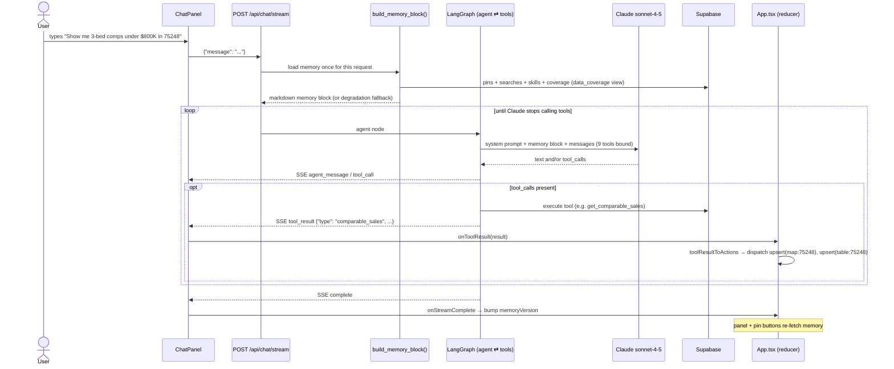
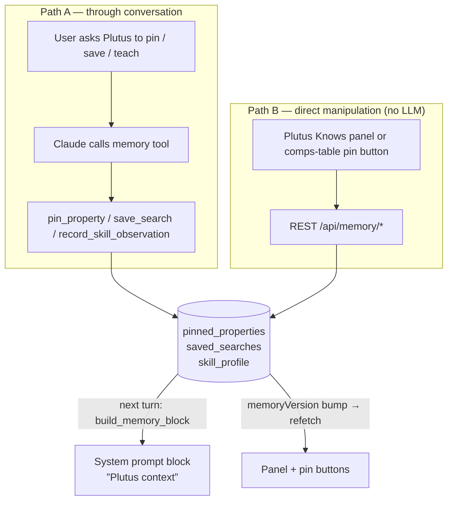
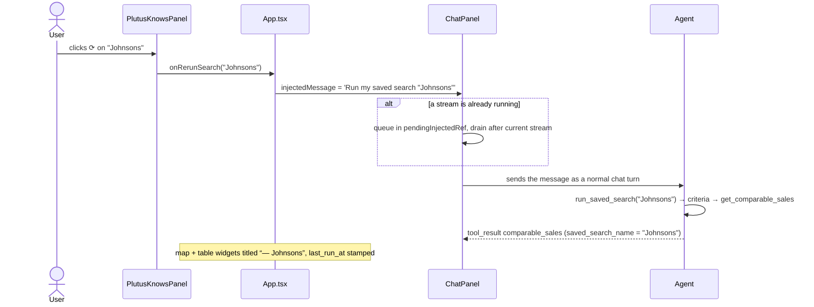
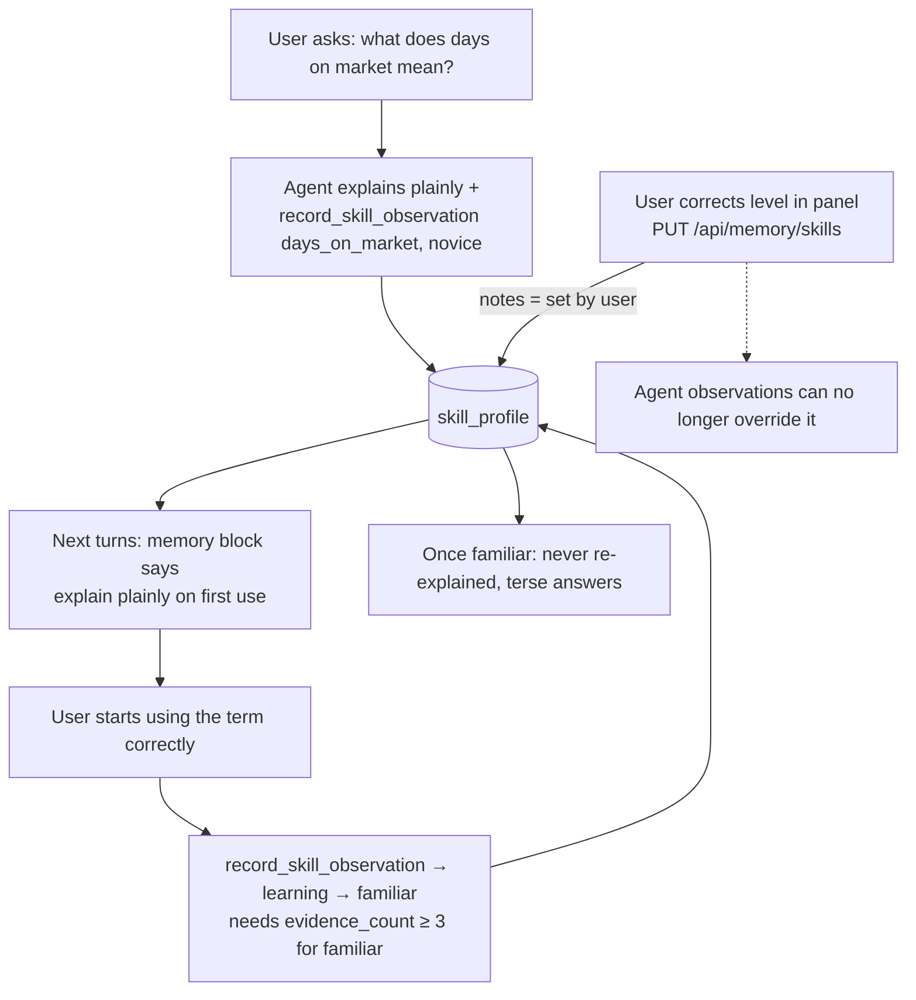
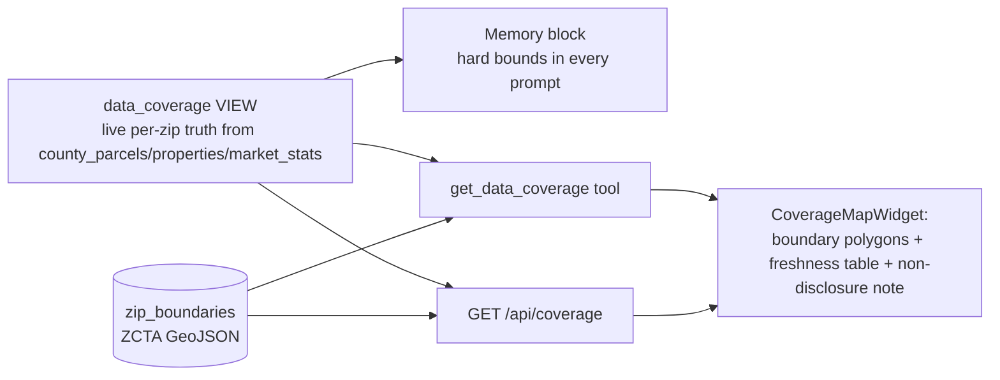
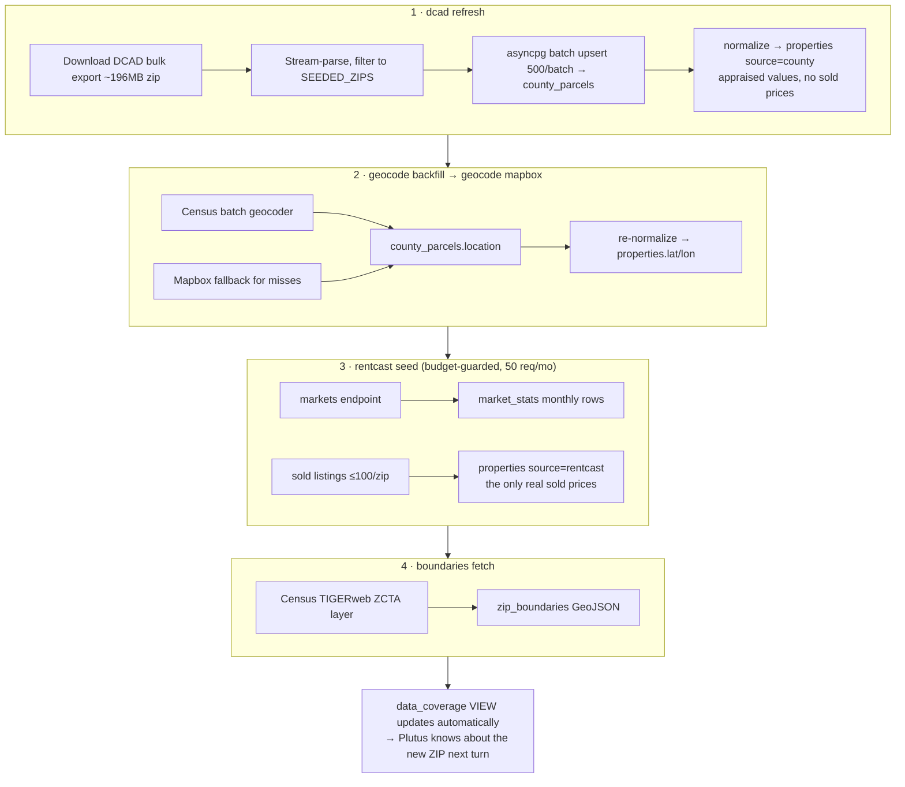

# System Flows — DFW Realtor Agent Platform

> Companion docs: [ARCHITECTURE.md](./ARCHITECTURE.md) · [DEMO-GUIDE.md](./DEMO-GUIDE.md)

Every important runtime path through the system, end to end. Diagrams are
Mermaid (rendered by GitHub / VS Code preview).

---

## 1. A chat turn, end to end

The core loop of the whole product. Everything the user sees on the canvas is
a side effect of this flow.



Key facts:
- **Memory is loaded once per request**, not per agent hop, and appended to
  the system prompt. Panel edits made between turns are picked up automatically.
- The final answer ends with `---SUGGESTION---` + a follow-up suggestion; the
  ChatPanel renders it as a visually separate block.
- Each turn is stateless server-side (no session persistence yet) — the
  durable state is Plutus memory, not conversation history.

### SSE event protocol

| Event | Payload | Frontend reaction |
|---|---|---|
| `agent_message` | `{content, node}` | Append/replace assistant bubble text |
| `tool_call` | `{tool, args}` | Inline "Plutus is running X" activity row |
| `tool_result` | `{tool, result}` | `toolResultToActions(result)` → widget dispatch; memory bump for `pin_update` / `saved_search_update` / `skill_update` |
| `complete` | `{}` | End stream, bump `memoryVersion` |
| `error` | `{error}` | Show error state in chat |

### Tool result → widget mapping

| `result.type` | Canvas effect (content-identity keys) |
|---|---|
| `comparable_sales` | upsert `map:<zip>` + `table:<zip>` — same ZIP replaces, new ZIP adds |
| `market_data` | upsert `trend:<zip>` |
| `pin_update` (action `pinned`) | upsert `card:<property_id>` |
| `data_coverage` | upsert `coverage` |
| `widget_dismiss` | dismiss `widget_key` |
| unknown | ignored (forward compatibility) |

---

## 2. Memory writes — two paths, one substrate

Both the agent (via tools) and the user (via the Plutus Knows panel / pin
buttons) write the **same Supabase tables**. Neither path is a cache of the
other, so they can never disagree for more than one turn.



Consistency mechanisms:
- **`memoryVersion`** (an integer in `App.tsx`) bumps on memory-mutating tool
  results, on stream completion, and on any REST mutation. The panel and pin
  hydration re-fetch when it changes.
- **Preserve-on-omit upserts**: re-saving a pin/search/skill without the
  optional note keeps the stored note (PostgREST updates only payload-present
  columns).
- **User authority**: a skill level edited in the panel is stamped
  `notes = "set by user"`; `upsert_skill` refuses to let agent observations
  override it. Separately, the agent can't claim `familiar` until
  `evidence_count >= 3` (demoted to `learning`).

---

## 3. Saved-search rerun from the panel

The rerun button doesn't call the search API directly — it routes through the
chat so the agent runs it, narrates it, and the results land on the canvas
like any other turn.



---

## 4. The teaching loop ("learns-with-you")



Demo-visible consequences:
- First mention of an unknown concept → one plain-English sentence, exactly once.
- Concepts marked `familiar` are never re-explained (familiar-suppression).
- A panel correction beats the agent's opinion permanently.

---

## 5. Coverage honesty flow

Two entry points, one widget.

**In-chat (agent-driven):** the user asks about somewhere the platform has no
data (e.g. Fort Worth / Tarrant County). The memory block already told the
agent its hard bounds, so it (1) says plainly it has no data there, (2) calls
`get_data_coverage` so the canvas *shows* the actual bounds, (3) offers what it
can do instead.

**Header button (direct):** `Coverage` button → `GET /api/coverage` →
dispatches the `coverage` widget without involving the agent.



Because coverage is a VIEW, ingesting a new ZIP instantly updates the agent's
self-knowledge, the coverage map, and the refusal behavior — no config change.

---

## 6. Pin flow (both directions)

```mermaid
sequenceDiagram
    actor U as User
    participant T as CompsTableWidget
    participant REST as /api/memory/pins
    participant G as Agent

    Note over T: pin buttons hydrate from GET /api/memory/pins (keyed on memoryVersion)
    alt via table button
        U->>T: clicks pin on a row
        T->>T: optimistic in-flight state
        T->>REST: POST {property_id}
        T->>T: bump memoryVersion → re-hydrate
    else via chat
        U->>G: "Pin 5217 Milam St for the Johnsons"
        G->>G: pin_property → find_property_by_address (UUID fast-path, ILIKE; asks if ambiguous)
        G-->>T: tool_result pin_update → card widget + memory bump
    end
    Note over G: next turn, the pin appears in the memory block:<br/>“Pinned properties: 5217 Milam St (75204) — note: …”
```

---

## 7. Data ingestion pipeline (offline, CLI)

How the database got its 41k parcels. Run order for seeding a new ZIP:



Cross-cutting behavior:
- **Response cache** (`api_responses`): every external call cached with
  per-endpoint TTLs (RentCast markets 30d, listings 90d; Census/FEMA/WalkScore
  365d). Re-runs are cheap and idempotent.
- **Budget guard** (`api_budget`): RentCast capped at 50 requests/month;
  exceeding raises before the HTTP call.

### Lazy market-data fallback (runtime)

If the agent calls `fetch_market_data` for a ZIP with no cached stats, the tool
tries a live RentCast fetch + normalize inline (budget permitting) before
returning "no data" — so a coverage-adjacent ZIP can cold-start during a
conversation.

---

## 8. Failure & degradation paths

| Failure | Behavior |
|---|---|
| Memory/DB load fails at turn start | Static fallback block: "do not reference pins/searches/skills; coverage unknown this turn" + non-disclosure caveat retained. Chat still works |
| A memory tool fails mid-turn | Tool returns `{"type": …, "error": …}`; agent explains; stream survives |
| Unknown tool-result type reaches frontend | Ignored by `toolResultToActions` — no crash |
| Comps rows with missing/(0,0) coords | MapWidget filters them out (Null-Island guard) |
| Saved-search/skill names containing `/` | `:path` route converters + `encodeURIComponent` on the client |
| Rerun clicked mid-stream | Queued in `pendingInjectedRef`, drained after the active stream completes |
| RentCast budget exhausted | Lazy fetch fails gracefully → tool returns explicit error payload |
